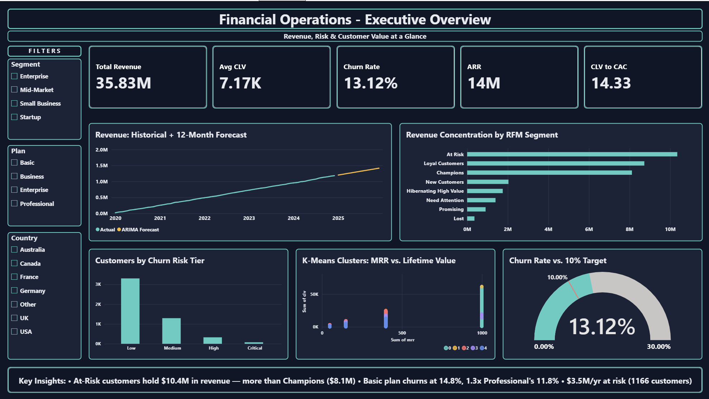
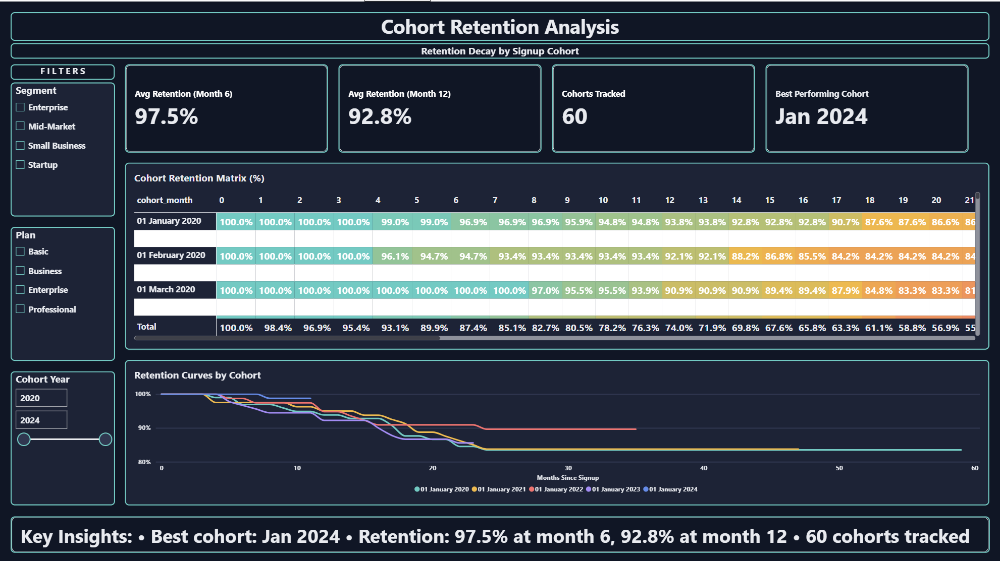
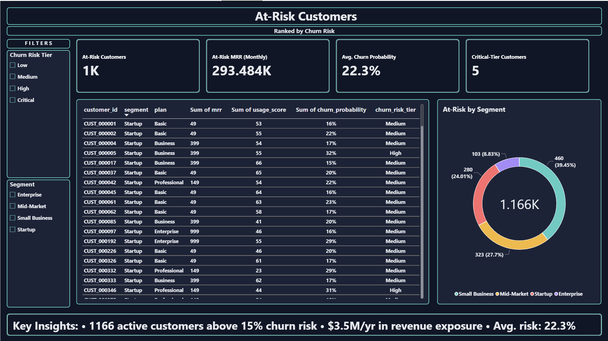
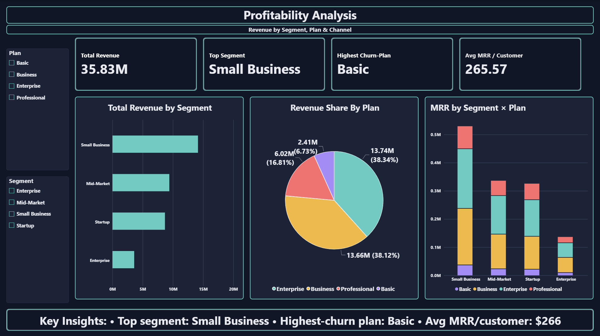
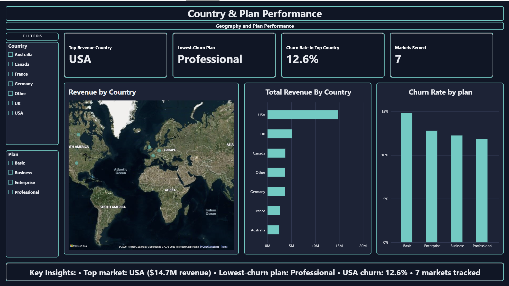

# Financial Operations Analytics

End-to-end analytics project simulating a 5-year SaaS business — revenue forecasting, churn prediction, customer segmentation, and cohort retention — built in Python and presented as an interactive 5-page Power BI dashboard.

**Dataset:** 5,000 customers, 135,218 transactions, $35.83M in simulated revenue (2020–2024). Synthetic data, generated with a deliberately planted signal (usage score → churn) so every downstream model and finding could be validated against ground truth.

---

## Highlights

- **Revenue forecasting** — ARIMA and Prophet models, 0.77% MAPE (99.2% accuracy) on held-out data
- **Churn prediction — found and fixed a real data leakage bug.** Initial models scored a suspicious 1.000 ROC AUC; traced it to features (`recency_days`, `lifetime_months`, `transaction_count`) that encoded the outcome itself. Rebuilt with only genuine leading indicators → an honest **0.756 ROC AUC** (Gradient Boosting)
- **$3.5M/year in revenue flagged as at-risk**, across 1,166 active customers above a 15% churn-probability threshold
- **RFM segmentation** surfaced a non-obvious finding: the "At Risk" segment holds *more* revenue ($10.4M) than "Champions" ($8.1M) — the business's most valuable customers are showing early warning signs
- **Cohort retention analysis** with a bias check — excluded cohorts under 6 months old before ranking "best performing cohort," since young cohorts can look artificially strong just from not having had time to churn yet
- **K-Means clustering** found behavioral customer segments that cut across pricing tiers, not just reproducing plan price

## Why the leakage fix matters

A perfect model score is a red flag, not a win. The original churn model hit 1.000 ROC AUC because several features were computed from transaction history that *stops* the moment a customer churns — meaning the model could effectively read the answer off the data rather than predict it. Catching this, diagnosing the exact cause, and rebuilding with an honest 0.756 ROC AUC was a deliberate part of this project, not an afterthought — a dashboard or model that can't explain a suspiciously good number isn't trustworthy.

---

## Repository Structure

```
├── notebooks/
│   └── Financial_Operations_Analytics.ipynb    # Full analysis: data gen → forecasting → churn → RFM/CLV → clustering
├── data/
│   ├── financial_customers.csv
│   ├── financial_transactions.csv
│   ├── monthly_revenue.csv
│   ├── at_risk_customers.csv
│   ├── rfm_segmentation.csv
│   ├── customers_for_powerbi.csv
│   └── forecast_export.csv
├── dashboards/
│   └── Financial_Operations_Analytics.pbix     # 5-page interactive Power BI dashboard
├── outputs/
│   ├── figures/                                 # 14 matplotlib charts from the notebook
│   └── kpi_summary.txt
└── screenshots/                                  # Power BI dashboard pages
```

---

## Power BI Dashboard

A 5-page interactive companion to the notebook, with cross-filtering slicers and dynamic DAX measures that recalculate live as filters change — not static charts.

| Page | What it covers |
|---|---|
| **Executive Overview** | Revenue + 12-month forecast, RFM revenue concentration, churn risk tiers, K-Means clusters, churn-vs-target gauge |
| **Cohort & Retention** | Retention heatmap by signup cohort, retention curves, bias-checked "best cohort" |
| **At-Risk Customers** | Full at-risk customer list ranked by churn probability, risk-tier and segment breakdown |
| **Profitability Analysis** | Revenue by segment and plan, MRR by segment × plan |
| **Country & Plan Performance** | Revenue by geography (map + bar), churn rate by plan |

### Executive Overview


### Cohort & Retention


### At-Risk Customers


### Profitability Analysis


### Country & Plan Performance


*Open `dashboards/Financial_Operations_Analytics.pbix` in [Power BI Desktop](https://powerbi.microsoft.com/desktop/) (free) to explore the dashboard yourself — every slicer and visual is fully interactive.*

---

## Methodology

**1. Synthetic data generation** — 5,000 customers across 4 segments and 4 pricing plans, with churn probability deliberately tied to a usage score so later models have a real, known signal to recover.

**2. Revenue forecasting** — seasonal decomposition, ADF stationarity testing, ACF/PACF analysis, ARIMA(1,1,1), and Prophet as a second, independent forecasting approach. Both converged within 1% of each other on the 12-month forward forecast.

**3. Churn prediction** — Logistic Regression, Random Forest, and Gradient Boosting compared. Includes the leakage diagnosis and fix described above, plus threshold analysis: the default 0.5 classification cutoff caught only 5% of real churners despite a reasonable ROC AUC, so the final model uses a business-calibrated 15% probability threshold instead.

**4. Cohort, RFM & CLV analysis** — monthly retention cohorts, RFM quintile scoring and segment naming, and Customer Lifetime Value with an explicit caveat: raw CLV mechanically favors older cohorts (more time to accumulate revenue), so cross-cohort CLV comparisons are presented with that limitation stated, not as a clean trend.

**5. Profitability & clustering** — segment/plan/geography profitability (with an explicit flat-margin assumption flagged, not hidden), and K-Means clustering (k=5, chosen by elbow inspection rather than a hard rule) to find behavioral customer groups beyond simple pricing tiers.

---

## Tech Stack

**Python:** pandas, numpy, matplotlib, seaborn, statsmodels, scikit-learn, Prophet
**BI:** Power BI Desktop, DAX
**Data:** Synthetic, generated with a fixed random seed for reproducibility

---

## Notes on the Data

All data is synthetic, generated programmatically within the notebook — no real customer or company data is used. This was a deliberate choice to demonstrate the full analytics skillset (forecasting, classification, segmentation, dashboarding) without the privacy constraints that come with real business data, while still building in validation signals (like the usage-score-driven churn) to confirm the models were finding real patterns, not noise.
